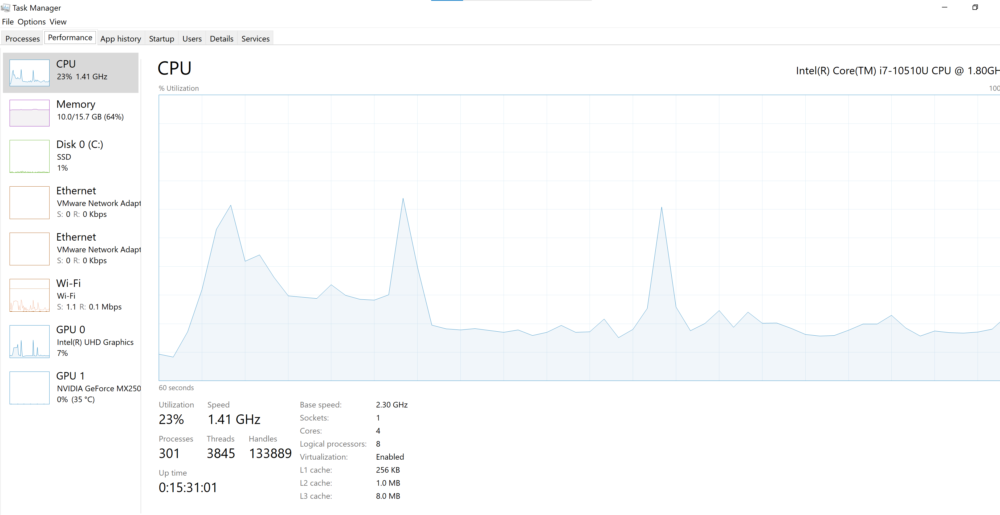

### Escuela Colombiana de Ingeniería


### Arquitecturas de Software – ARSW

## Laboratorio Programación concurrente, condiciones de carrera, esquemas de sincronización, colecciones sincronizadas y concurrentes - Caso Dogs Race

### Integrantes:

|     Nombre    |     Git         |
|--------------|------------- | 
| Camilo Rincón|[Rincon10](https://github.com/Rincon10 )  |
|Galeano Garzón |[Ersocaut](https://github.com/Ersocaut)   |

###  Ejecutando el proyecto

#### Parte I
```
mvn exec:java -Dexec.mainClass="edu.eci.arsw.primefinder.Main"
```

#### Parte II
```
mvn exec:java -Dexec.mainClass="edu.eci.arsw.threads.MainCanodromo"
```

### Descripción:
Este ejercicio tiene como fin que el estudiante conozca y aplique conceptos propios de la programación concurrente.

### Parte I 
Antes de terminar la clase.

Creación, puesta en marcha y coordinación de hilos.

1. Revise el programa “primos concurrentes” (en la carpeta parte1), dispuesto en el paquete edu.eci.arsw.primefinder. Este es un programa que calcula los números primos entre dos intervalos, distribuyendo la búsqueda de los mismos entre hilos independientes. Por ahora, tiene un único hilo de ejecución que busca los primos entre 0 y 30.000.000. Ejecútelo, abra el administrador de procesos del sistema operativo, y verifique cuantos núcleos son usados por el mismo.
    Como se logra apreciar en las siguientes imágenes, el sistema operativo está usando los 8 núcleos lógicos disponibles que posee nuestra máquina física
    <br>
    
    <br>
    <br>
     


2. Modifique el programa para que, en lugar de resolver el problema con un solo hilo, lo haga con tres, donde cada uno de éstos hará la tarcera parte del problema original. Verifique nuevamente el funcionamiento, y nuevamente revise el uso de los núcleos del equipo.
    
    * Tiempo de Ejecución antes de la modificación
    
        
    
    * Modificacion del programa:
        <br>
        
        <br>
    * Tiempo de Ejecución despues de la modificación
        
        
    
3. Lo que se le ha pedido es: debe modificar la aplicación de manera que cuando hayan transcurrido 5 segundos desde que se inició la ejecución, se detengan todos los hilos y se muestre el número de primos encontrados hasta el momento. Luego, se debe esperar a que el usuario presione ENTER para reanudar la ejecución de los mismo. <br>
        


### Parte II 


Para este ejercicio se va a trabajar con un simulador de carreras de galgos (carpeta parte2), cuya representación gráfica corresponde a la siguiente figura:


En la simulación, todos los galgos tienen la misma velocidad (a nivel de programación), por lo que el galgo ganador será aquel que (por cuestiones del azar) haya sido más beneficiado por el *scheduling* del
procesador (es decir, al que más ciclos de CPU se le haya otorgado durante la carrera). El modelo de la aplicación es el siguiente:


Como se observa, los galgos son objetos ‘hilo’ (Thread), y el avance de los mismos es visualizado en la clase Canodromo, que es básicamente un formulario Swing. Todos los galgos (por defecto son 17 galgos corriendo en una pista de 100 metros) comparten el acceso a un objeto de tipo
RegistroLLegada. Cuando un galgo llega a la meta, accede al contador ubicado en dicho objeto (cuyo valor inicial es 1), y toma dicho valor como su posición de llegada, y luego lo incrementa en 1. El galgo que
logre tomar el ‘1’ será el ganador.

Al iniciar la aplicación, hay un primer error evidente: los resultados (total recorrido y número del galgo ganador) son mostrados antes de que finalice la carrera como tal. Sin embargo, es posible que una vez corregido esto, haya más inconsistencias causadas por la presencia de condiciones de carrera.

Parte III

1.  Corrija la aplicación para que el aviso de resultados se muestre
    sólo cuando la ejecución de todos los hilos ‘galgo’ haya finalizado.
    Para esto tenga en cuenta:

    a.  La acción de iniciar la carrera y mostrar los resultados se realiza a partir de la línea 38 de MainCanodromo.

    b.  Puede utilizarse el método join() de la clase Thread para sincronizar el hilo que inicia la carrera, con la finalización de los hilos de los galgos.
    
    * El mensaje no salta al inicio de la carrera
    <br>
    
    <br>
    
    * El mensaje sale únicamente al final de la carrera
    <br>
    
    <br>
    
    * El ouput se genera después de Aceptar el mensaje anterior
    <br>
    
    <br>

2.  Una vez corregido el problema inicial, corra la aplicación varias
    veces, e identifique las inconsistencias en los resultados de las
    mismas viendo el ‘ranking’ mostrado en consola (algunas veces
    podrían salir resultados válidos, pero en otros se pueden presentar
    dichas inconsistencias). A partir de esto, identifique las regiones
    críticas () del programa.
    
    * Las inconsistncias encontradas son dos principalmente, el orden del output no presenta ningun orden aparente y varios galgos pueden ocupar la misma posición, dejando posiciones sin ocupar.
    <br>
    
    
    <br>

3.  Utilice un mecanismo de sincronización para garantizar que a dichas
    regiones críticas sólo acceda un hilo a la vez. Verifique los
    resultados.

    * Realizando el siguiente cambio dentro del código de la clase Galgo solventamos las incosistencias encontradas:
    
    ```
    synchronized (regl){
	    carril.finish();
		int ubicacion = regl.getUltimaPosicionAlcanzada();
		regl.setUltimaPosicionAlcanzada(ubicacion+1);
		System.out.println("El galgo "+this.getName()+" llego en la posicion "+ubicacion);
		if (ubicacion == 1){
	        regl.setGanador(this.getName());
		}
	}
     ```
    Resultando en el siguiente output correcto:
    
    <br>
    
    <br>

4.  Implemente las funcionalidades de pausa y continuar. Con estas,
    cuando se haga clic en ‘Stop’, todos los hilos de los galgos
    deberían dormirse, y cuando se haga clic en ‘Continue’ los mismos
    deberían despertarse y continuar con la carrera. Diseñe una solución que permita hacer esto utilizando los mecanismos de sincronización con las primitivas de los Locks provistos por el lenguaje (wait y notifyAll).
    
    Para poder solventar los problemas encontrados en las opciones de 'Stop' y 'Continue' es necesario realizar cambios en la clase Galgo y MainCanodromo:

    * Los cambios en la clase Galgo se pueden resumir en:
        
        * Añadimos un nuevo atributo booleano isPaused.
        * Añadimos un bloque while con wait(); dentro del método corra para generar la pausa que se regira por el nueco atributo.
        * Añadimos los métodos reanudar(); y pause(); que generan el cambio en el nuevo atributo.
    
    ```
    public class Galgo extends Thread {
    	private Boolean isPaused = false;
        .
        .
        .
        public void corra() throws InterruptedException {
            .
            .
            .
            synchronized (this){
				while(isPaused){
					wait();
				}
			}
            .
            .
            .
        }
        public synchronized void reanudar(){
		    isPaused = false;
		    notifyAll();
	    }

	    public synchronized void pause(){
		    isPaused = true;
	    }
    }
    ```
    * Los cambios en la clase MainCanodromo son:

        * Modificamos las acciones realizadas por el botón Stop por medio del método can.setStopAction();
        * Modificamos las acciones realizadas por el botón Continue por medio del método can.setContinueAction();
    
    ```
    public class MainCanodromo {
    .
    .
    .
        public static void main(String[] args) {
            .
            .
            .
            can.setStopAction(
                new ActionListener() {
                    @Override
                    public void actionPerformed(ActionEvent e) {
                        for (Galgo g : galgos){
                            g.pause();
                        }
                        System.out.println("Carrera pausada!");
                    }
                }
            );

            can.setContinueAction(
                new ActionListener() {
                    @Override
                    public void actionPerformed(ActionEvent e) {
                        for (Galgo g : galgos){
                            g.reanudar();
                        }
                        System.out.println("Carrera reanudada!");
                    }
                }
            );
        }
    }
    ```
    * Generando ya el comportamiento deseado de los botones y acciones 'Stop' y 'Continue':
    * Generamos que la carrera se detenga en un par de ocasiones y luego la reanudamos:
    <br>
    
    <br>
    * Dejamos que la carrera termine luego de haberla pausado:
    <br>
    
    <br>

Referencias 

* Sincronizacion de hilos [online] Available at: <https://javadesdecero.es/avanzado/sincronizacion-de-hilos/> [Accessed 19 August 2021].
* Concurrencia. [online] Available at: <https://www.dit.upm.es/~pepe/libros/concurrency/index.html#!1023> [Accessed 19 August 2021].
* Explicacion de synchronize. [online] Available at: <https://www.dlsi.ua.es/asignaturas/pc/teoria/t05.pdf> [Accessed 23 August 2021].
